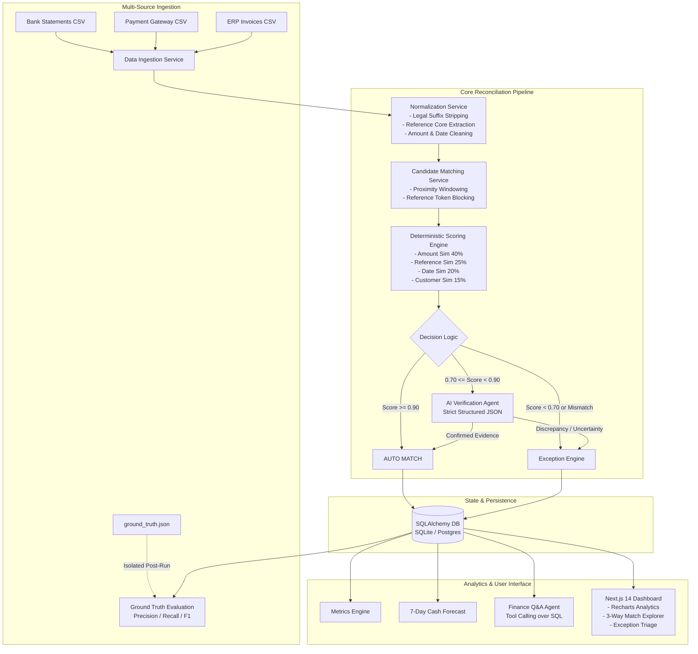

# 🏦 AI Finance Controller — Multi-Source Reconciliation & Autonomous Operations Agent

[](https://www.python.org/)
[](https://fastapi.tiangolo.com/)
[](https://nextjs.org/)
[](https://www.typescriptlang.org/)
[](https://tailwindcss.com/)
[](https://opensource.org/licenses/MIT)

> **"The AI Finance Controller is not judged by how many transactions it matches. It is judged by how reliably it distinguishes correct matches from transactions that need human attention."**

An enterprise-grade, learning-oriented financial operations system designed to ingest, normalize, reconcile, and audit 3-way financial records across **Bank Statements**, **Payment Gateway Logs**, and **ERP Invoices** with deterministic multi-factor scoring, structured AI verification, and zero-leakage ground-truth evaluation.

---

## 📑 Table of Contents

1. [Why Financial Reconciliation is Difficult](#-why-financial-reconciliation-is-difficult)
2. [High-Level Architecture](#-high-level-architecture)
3. [Core Capabilities & Principles](#-core-capabilities--principles)
4. [Reconciliation Pipeline Deep Dive](#-reconciliation-pipeline-deep-dive)
5. [Ground Truth Benchmark & Evaluation Methodology](#-ground-truth-benchmark--evaluation-methodology)
6. [AI Provider Abstraction & Safe Fallback](#-ai-provider-abstraction--safe-fallback)
7. [Project Structure](#-project-structure)
8. [Getting Started Locally](#-getting-started-locally)
9. [API Reference](#-api-reference)
10. [Educational Code Tour (Where to Start)](#-educational-code-tour-where-to-start)
11. [Limitations & Production Roadmap](#-limitations--production-roadmap)

---

## 🔍 Why Financial Reconciliation is Difficult

In modern fintech and corporate finance, automated reconciliation between internal ledgers, payment gateways, and banking institutions encounters pervasive noise:

1. **Entity Name Inconsistencies**: A company registered as `"Acme Technologies Pvt. Ltd."` appears on a bank statement as `"ACME TECH"`, on a gateway charge as `"Acme Private Limited"`, and in ERP invoices as `"Acme Technologies Inc."`.
2. **Reference Code Variations**: Identifier prefixes vary across payment rails (`"REF-83921"`, `"PAY-83921"`, `"INV/2026/83921"`, `"PG_83921"`).
3. **Settlement Timing Discrepancies**: Invoices issued on Day $T$ may capture on Day $T+1$ through a payment gateway and settle to the bank on Day $T+3$.
4. **Amount Discrepancies & Deductions**: Gateway Merchant Discount Rates (MDR fees e.g. 2.5%), partial payments, or currency conversions create slight monetary differences between bank credits and invoice totals.
5. **Operational Edge Cases**: Duplicate charges, refunds, chargebacks, failed gateway attempts, and missing bank credits require strict human escalation rather than forced matches.

---

## 🏛 High-Level Architecture



---

## 🛡 Core Capabilities & Principles

- **Never Manufacture Evidence**: If an invoice is ₹50,000 and gateway captured is ₹5,000, the system refuses to force a match; it creates a structured `AMOUNT_MISMATCH` exception.
- **When Uncertain, Escalate to Human**: Records with ambiguous signals in the $[0.70, 0.90)$ threshold are escrowed for human operator review.
- **Zero Ground-Truth Leakage**: The ground truth dataset is strictly sequestered from the inference pipeline and queried only during post-run evaluation to measure authentic empirical Precision, Recall, and F1.
- **AI-Safe Fallback**: If an LLM times out or encounters network degradation, the pipeline gracefully falls back to deterministic review without crashing.
- **Finance Q&A with Zero Hallucinations**: Natural language queries are grounded strictly through SQL tool executions (`get_reconciliation_summary`, `get_largest_discrepancies`, `get_unsettled_amount`).

---

## ⚙ Reconciliation Pipeline Deep Dive

### 1. Normalization Engine (`backend/app/services/normalization.py`)
Standardizes messy multi-source data while preserving the original strings for audit logs:
- **Entity Names**: Regex stripping of legal suffixes (`"Pvt Ltd"`, `"LLC"`, `"Inc"`, `"Private Limited"`) and whitespace canonicalization.
- **References**: Strips transaction prefixes (`"REF-"`, `"PAY-"`, `"INV/"`, `"PG_"`) to isolate the core alphanumeric token.
- **Amounts**: Cleans currency symbols (`₹`, `$`, `,`) and standardizes to 2-decimal floats.
- **Dates**: Resolves ISO-8601, UK (`DD/MM/YYYY`), and US (`MM/DD/YYYY`) formats to standard `datetime.date`.

### 2. Candidate Generation & Blocking (`backend/app/services/candidate_matching.py`)
Prevents $O(N \cdot M \cdot K)$ Cartesian explosion by building fast indexed blocking keys:
- Direct Core Reference Hash Lookup ($O(1)$)
- Monetary Amount Proximity Window ($|A_1 - A_2| \le \text{tolerance}$)
- Date Settlement Horizon ($|\Delta t| \le 5\text{ days}$)

### 3. Deterministic Multi-Factor Scorer (`backend/app/services/scoring.py`)
Computes an explainable weighted similarity composite score:
$$\text{Score} = w_{\text{amount}} S_{\text{amount}} + w_{\text{ref}} S_{\text{ref}} + w_{\text{date}} S_{\text{date}} + w_{\text{cust}} S_{\text{cust}}$$
- **Amount Similarity ($S_{\text{amount}}$)**: $1.0$ for exact; smooth exponential decay for small fee deductions.
- **Date Similarity ($S_{\text{date}}$)**: $1.0$ for same-day; step decay ($0.95$ for 1-day lag, $0.90$ for 2-day lag).
- **Reference Similarity ($S_{\text{ref}}$)**: RapidFuzz token sort ratio + substring containment boost.
- **Customer Similarity ($S_{\text{cust}}$)**: RapidFuzz token set ratio on normalized entity strings.

### 4. Exception Engine (`backend/app/services/exceptions.py`)
Classifies discrepancies into explicit categories with monetary exposures:
- `AMOUNT_MISMATCH`
- `MISSING_GATEWAY` / `MISSING_BANK` / `MISSING_INVOICE`
- `DUPLICATE`
- `PAYMENT_FAILED`
- `REFUND`
- `PARTIAL_PAYMENT`
- `DATE_MISMATCH`

---

## 📊 Ground Truth Benchmark & Evaluation Methodology

To measure genuine performance, `scripts/generate_dataset.py` creates:
- 250+ realistic records across Bank, Gateway, and Invoices with controlled noise (~70% clean matches, ~10% entity variations, ~5% fee/amount mismatches, ~5% duplicates, ~5% missing records, ~5% failed/refunds).
- An isolated `ground_truth.json` benchmark.

The Evaluation Service calculates:
- **Precision**: $\frac{TP}{TP + FP}$ (Measures match reliability and false positive immunity)
- **Recall**: $\frac{TP}{TP + FN}$ (Measures coverage of eligible transactions)
- **F1 Score**: $2 \cdot \frac{\text{Precision} \cdot \text{Recall}}{\text{Precision} + \text{Recall}}$
- **False Positive Rate (FPR)**: $\frac{FP}{FP + TN}$ (Critical fintech risk metric)
- **Exception Detection Accuracy**: Percentage of actual ground-truth discrepancies caught.

---

## 🤖 AI Provider Abstraction & Safe Fallback

The backend provides a unified `BaseLLMClient` interface configurable via `LLM_PROVIDER`:
- `mock`: Deterministic heuristic auditor (zero setup, ideal for testing & local demos)
- `openai`: OpenAI GPT-4o / GPT-4o-mini with JSON mode
- `anthropic`: Anthropic Claude 3.5 Sonnet
- `gemini`: Google Gemini 1.5 Flash

---

## 📂 Project Structure

```
ai-finance-controller/
├── backend/
│   ├── app/
│   │   ├── main.py                  # FastAPI Application Entry & Lifespan
│   │   ├── config.py                # Pydantic Settings & Matching Thresholds
│   │   ├── db/                      # SQLAlchemy 2.0 Engine & Base
│   │   ├── models/                  # Bank, Gateway, Invoice, Match, Exception Models
│   │   ├── schemas/                 # Pydantic Request & Response Models
│   │   ├── services/
│   │   │   ├── normalization.py      # Entity & Reference Canonicalization
│   │   │   ├── candidate_matching.py # Fast Proximity Blocking
│   │   │   ├── scoring.py            # Multi-factor Deterministic Scorer
│   │   │   ├── reconciliation.py     # End-to-end Pipeline Orchestrator
│   │   │   ├── exceptions.py         # Exception Triage Service
│   │   │   ├── evaluation.py         # Ground Truth Benchmark Evaluator
│   │   │   ├── ingestion.py          # CSV Validator & Ingestor
│   │   │   └── forecasting.py        # 7-Day Rule-based Cash Flow Forecast
│   │   ├── agents/
│   │   │   ├── llm_provider.py       # OpenAI / Anthropic / Gemini / Mock Abstraction
│   │   │   ├── reconciliation_agent.py # Structured JSON Verification Agent
│   │   │   ├── finance_qa_agent.py   # Tool-grounded SQL Q&A Agent
│   │   │   └── prompts.py            # Audit Prompts & JSON Schemas
│   │   └── api/                     # Clean REST Routers
│   ├── tests/                       # 15 Integration & Unit Tests
│   └── requirements.txt
│
├── frontend/
│   ├── app/
│   │   ├── page.tsx                 # Real-time Executive Dashboard
│   │   ├── transactions/page.tsx    # Searchable 3-Way Match Explorer
│   │   ├── exceptions/page.tsx      # Exception Triage Workspace
│   │   ├── chat/page.tsx            # Tool-Grounded Finance Q&A Interface
│   │   └── forecast/page.tsx        # 7-Day Cash Trajectory & Drivers
│   ├── components/                  # Modals, Navbar, KPI Cards & Recharts
│   ├── lib/                         # API Client & Formatting Helpers
│   └── types/                       # TypeScript Type Definitions
│
├── scripts/
│   └── generate_dataset.py          # Synthetic Data & Ground Truth Generator
├── docker-compose.yml
├── .env.example
└── pytest.ini
```

---

## 🚀 Getting Started Locally

### Prerequisites
- **Python 3.11+** or **3.14**
- **Node.js 18+** / **npm 9+**

### 1. Clone & Configure Environment
```bash
cp .env.example .env
```

### 2. Run Backend
```bash
# Navigate to backend and install requirements
cd backend
pip install -r requirements.txt

# Run pytest to verify all services
python -m pytest

# Start FastAPI server (Runs on http://127.0.0.1:8000)
python -m uvicorn app.main:app --reload --port 8000
```

### 3. Run Frontend
```bash
# In a separate terminal, navigate to frontend
cd frontend
npm install
npm run dev
# Frontend runs on http://localhost:3000
```

### 4. Docker Deployment (Optional)
```bash
docker-compose up --build
```

---

## 📡 API Reference

| Method | Endpoint | Description |
|---|---|---|
| `POST` | `/api/data/generate?count=250` | Generates synthetic multi-source dataset and loads to DB |
| `POST` | `/api/data/upload` | Ingests custom Bank, Gateway, and Invoice CSVs |
| `POST` | `/api/reconciliation/run` | Executes complete reconciliation pipeline |
| `GET` | `/api/reconciliation/latest` | Retrieves latest run summary & counters |
| `GET` | `/api/transactions` | Lists paginated matches with multi-filtering |
| `GET` | `/api/transactions/{id}` | Returns 3-way side-by-side transaction comparison |
| `GET` | `/api/exceptions` | Lists active financial exception records |
| `PATCH`| `/api/exceptions/{id}` | Updates exception triage status (`IN_REVIEW`, `RESOLVED`, `IGNORED`) |
| `GET` | `/api/metrics` | Fetches operational KPIs & Ground Truth evaluation benchmarks |
| `POST` | `/api/finance/chat` | Natural language queries with SQL tool calling |
| `GET` | `/api/forecast` | Returns 7-day rule-based rolling cash flow forecast |

---

## 🎓 Educational Code Tour (Where to Start)

For engineers exploring this codebase, study these files first:

1. **[`scripts/generate_dataset.py`](scripts/generate_dataset.py)**: Understand how controlled noise, entity abbreviations, and ground-truth relationships are created.
2. **[`backend/app/services/normalization.py`](backend/app/services/normalization.py)**: Learn how legal suffixes and transaction prefixes are canonicalized.
3. **[`backend/app/services/scoring.py`](backend/app/services/scoring.py)**: Study the multi-factor mathematical scoring formulas.
4. **[`backend/app/services/reconciliation.py`](backend/app/services/reconciliation.py)**: Follow the end-to-end pipeline lifecycle.
5. **[`backend/app/services/evaluation.py`](backend/app/services/evaluation.py)**: See how Precision, Recall, and F1 are computed without inference leakage.
6. **[`backend/app/agents/finance_qa_agent.py`](backend/app/agents/finance_qa_agent.py)**: Discover how tool calling eliminates financial hallucinations.

---

## ⚖ Limitations & Production Roadmap

- **Currency Conversion**: Current version standardizes to single base currency (INR / USD). Production implementations should integrate live FX rate feeds.
- **Complex N-to-M Bundling**: Current candidate generator handles 1-to-1-to-1 matching and duplicate 2-to-1 charges. Future versions can incorporate mixed integer linear programming (MILP) for complex split-bill batch settlements.
- **Persistent Event Sourcing**: For bank-grade ledgers, append-only event sourcing (e.g. Kafka / LedgerDB) should track every balance adjustment.

---

## 📄 License
MIT License. Built as an advanced AI financial engineering learning architecture.
